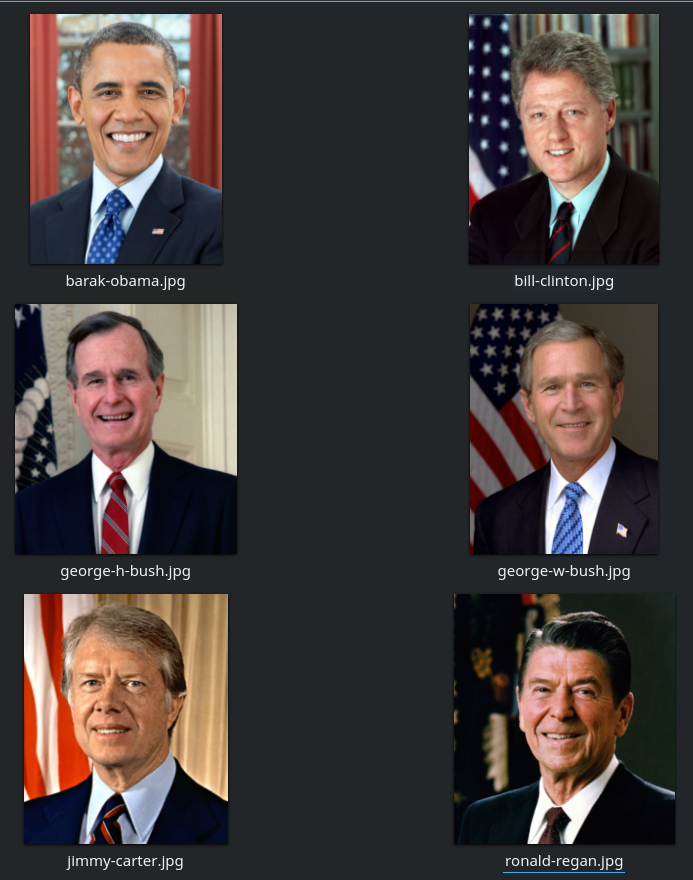
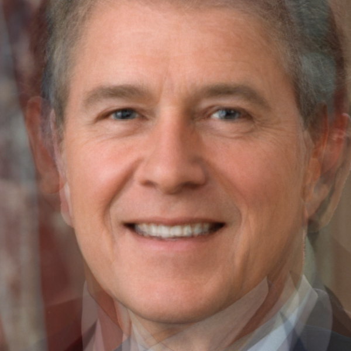

# Facial averaging

This software will automatically find all images in given directory, find faces in images, find facial landmarks and average all faces into one image and then save it in results directory.

## Example

| | |
|------------------------|---------------|
|  |  |

## Dependencies

1. python 3.x tested
2. install requirements (will take some time) `pip install -r requirements.txt`

## Run

Note that first run will take more time because it will automatically download pretrained face detection model.

```python face_average.py us_presidents/```

## References

Based on: https://www.learnopencv.com/average-face-opencv-c-python-tutorial/
